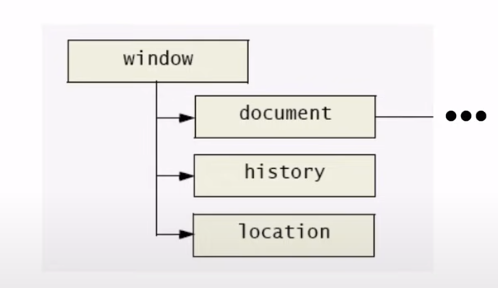
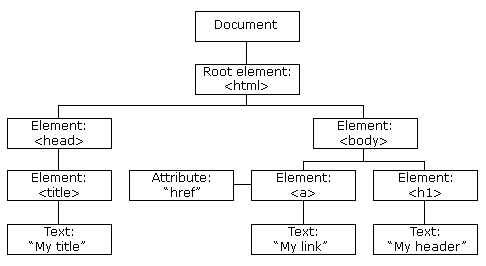
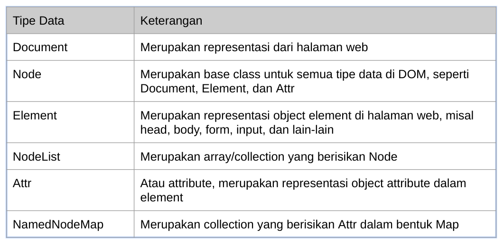
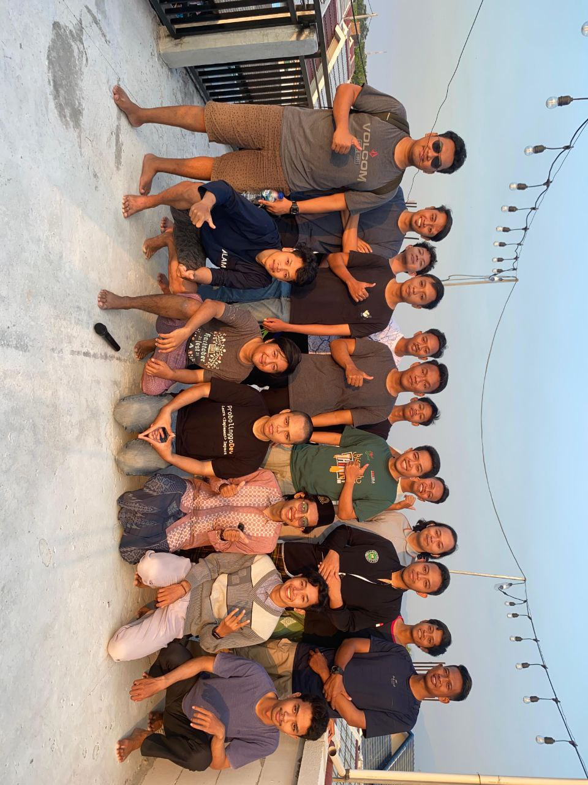

## Unlocking DOM Manipulation

Exploring the DOM with JavaScript Project

---

# Zainal Abidin

Frontend engineer more than 1 years experience.

Currently just starting my journey at startup <a href="https://delman.io/" target="_blank">delman.io</a> as a frontend engineer.

[linkedin](<[https://](https://www.linkedin.com/in/zaiinhs/)>) - [medium](https://medium.com/@zaiinhs)

---

# Pre-requisite :

- html
- css
- javascript

---

# Aplikasi pendukung

- code editor
- web browser

---

## Outline

- Pengenalan DOM
- DOM Tree
- document
- node
- element
- selection

- manipulation
- traversal
- event handler
- event bubbling

---

# Document Object Model

---

### Pengenalan DOM

<ul class="list-dom">
<li>
Ketika sebuah website di load oleh Browser, maka Browser akan membuat Document Object Model untuk halaman website tersebut
</li>
<li>
DOM dibuat dalam bentuk tree / pohon yang tiap cabang nya berisikan object dari jenis elemen HTML
</li>
<li>
JavaScript memiliki kemampuan untuk memanipulasi DOM, artinya dengan JavaScript, kita bisa mengakses tiap object di DOM bahkan memanipulasi object nya
</li>
</ul>

---

# DOM Tree

---

### DOM & JavaScript

<ul class="list-dom">
<li>
DOM bukanlah fitur atau bahasa pemrograman, DOM sebenarnya hanyalah representasi Object dari Struktur halaman web
</li>
<li>
DOM sendiri sebenarnya bukanlah bagian dari bahasa pemrograman JavaScript, melainkan bagian dari Web API
</li>
<li>
DOM sendiri di desain secara agnostik, artinya sebenarnya bisa digunakan menggunakan bahasa pemrograman apapun, karena memang untuk membuat Web, kita tidak hanya bisa menggunakan bahasa pemrograman JavaScript
</li>
</ul>

---

### Tipe data

<ul class="list-dom">
<li>
DOM memiliki representasi data
</li>
<li>
Tidak terlalu banyak tipe data yang terdapat di DOM
</li>
<li>
Oleh karena itu, sebenarnya DOM sangat sederhana, namun penggunaannya sangat bermanfaat
</li>
</ul>

---

### Tipe data

---

### document

<ul  class="list-dom">
<li>
Document merupakan representasi object dari halaman web
Dalam satu halaman web, terdapat satu document, dan kita tidak perlu membuatnya secara manual, karena otomatis akan ada di browser
Untuk mengakses Document, kita bisa gunakan object document

https://developer.mozilla.org/en-US/docs/Web/API/Document

</li>
</ul>

---

### Document Property

<ul  class="list-dom">
<li>
Document memiliki banyak sekali property
Property dalam Document bisa kita gunakan untuk melihat semua data yang terdapat dalam document halaman web

https://developer.mozilla.org/en-US/docs/Web/API/Document#properties

</li>
</ul>

---

### Document method

<ul  class="list-dom">
<li>
Document memiliki banyak sekali method
Banyak method yang terdapat di document digunakan untuk memanipulasi data DOM, misal membuat Node, Element, Attribute atau mengambil dan menyeleksi Node di dalam document

https://developer.mozilla.org/en-US/docs/Web/API/Document#methods

</li>
</ul>

---

# node

---

### Node

<ul  class="list-dom">
<li>
Node adalah base class dari Document, Element dan Attr
Artinya semua fitur yang dimiliki di Node dimiliki diturunannya
Node dalam DOM itu bentuknya adalah Tree (pohon), artinya dengan Node, kita bisa melihat Parent (node diatas nya), Children (node dibawahnya), Sibling (node disebelahnya)

https://developer.mozilla.org/en-US/docs/Web/API/Node

</li>
</ul>

---

### Node Property

<ul  class="list-dom">
<li>
Node memiliki banyak sekali property
Property di Node banyak berisi informasi reference ke Node lain nya, seperti ke node parent nya, node children nya atau node sebelahnya

https://developer.mozilla.org/en-US/docs/Web/API/Node#properties

</li>
</ul>

---

### Node Method

<ul  class="list-dom">
<li>
Node memiliki banyak sekali method
Method di Node bisa digunakan untuk memanipulasi data Node di dalam Node tersebut, misal menambah/menghapus Node children

https://developer.mozilla.org/en-US/docs/Web/API/Node#properties

</li>
</ul>

---

### Element

<ul  class="list-dom">
<li>
Element merupakan Node yang berbentuk element, biasanya adalah element HTML, misal

`<html>, <head>, <body>, 
, <table>,` dan lain-lain
https://developer.mozilla.org/en-US/docs/Web/API/Element

</li>
</ul>

---

### Element Property

<ul  class="list-dom">
<li>
Element memiliki banyak sekali property
Dan karena Element adalah turunan dari Node, semua property Node pun bisa digunakan di Element

https://developer.mozilla.org/en-US/docs/Web/API/Element#properties

</li>
</ul>

---

### Element method

<ul  class="list-dom">
<li>
Element memiliki banyak sekali method
Dan karena Element adalah turunan dari Node, semua method Node pun bisa digunakan di Element

https://developer.mozilla.org/en-US/docs/Web/API/Element#methods

</li>
</ul>

---

### Membuat Element

<ul  class="list-dom">
<li>
Sebelumnya kita hanya mengambil element menggunakan id, artinya kita perlu buat dulu element nya di HTML
Kita juga bisa membuat object element baru, dan menambahkannya ke halaman web
Kita bisa menggunakan method createElement(tag) pada Document

https://developer.mozilla.org/en-US/docs/Web/API/Document/createElement

</li>
</ul>

---

### Nodelist

<ul  class="list-dom">
<li>
NodeList adalah kumpulan dari Node
Biasanya NodeList digunakan ketika kita menyeleksi banyak Node sekaligus, misal ketika kita ingin mengambil semua children di Node misalnya

https://developer.mozilla.org/en-US/docs/Web/API/NodeList

</li>
</ul>

---

### Live vs static Nodelist

<ul  class="list-dom">
<li>
NodeList memiliki 2 tipe, yaitu Live dan Static
Live artinya perubahan yang terjadi pada NodeList nya, akan merubah semua NodeList yang sama
Static artinya perubahan yang terjadi pada NodeList nya, tidak akan merubah semua NodeList yang sama
Saat kita menggunakan element.childNodes, NodeList tersebut bersifat Live
Saat kita menggunakan document.querySelectorAll(), NodeList tersebut bersifat Static
</li>
</ul>

---

### Attr

<ul  class="list-dom">
<li>
Attr atau attribute merupakan representasi dari attribute sebuah element, atau singkatnya key-value, key nya adalah nama attribute, dan value nya adalah value attribute

https://developer.mozilla.org/en-US/docs/Web/API/Attr

</li>
</ul>

---

### Membuat Attr

<ul  class="list-dom">
<li>
Untuk membuat Attr, kita bisa menggunakan document.createAttribute(name)
Lalu untuk menambahkannya ke Element, kita bisa gunakan element.setAttributeNode(attr)
Atau kita juga bisa langsung membuat Attr langsung dengan name dan value nya menggunakan element.setAttribute(name, value)
</li>
</ul>

---

# Manipulation

dari yang sudah dipelajari ini, mari kita praktek an dengan memanipulasi elemen nya dengan menambahkan styling, setAtribut, dan juga menambahkan element baru.

---

# traversal

Penelusuran DOM

[Blog Medium](https://medium.com/codex/how-to-traverse-the-dom-in-javascript-7fece4a7751c)

---

### Event Handler

<ul  class="list-dom">
<li>
Node memiliki kemampuan bereaksi terhadap suatu kejadian, misal kejadian di klik, mouse di atas node tersebut, dan lain-lain
Ada banyak sekali jenis kejadian yang bisa kita buatkan aksinya ketika kejadian tersebut terjadi, atau dikenal dengan nama Event Handler
Ada dua cara kita menambahkan Event Handler ke Node, menggunakan Event Target atau Global Event Handler

https://developer.mozilla.org/en-US/docs/Web/API/EventTarget
https://developer.mozilla.org/en-US/docs/Web/API/GlobalEventHandlers

</li>
</ul>

---

### Event target

<ul  class="list-dom">
<li>
Event Target merupakan parent class dari Node, artinya semua Node memiliki kemampuan dari Event Target
Pada Event Target, kita bisa menggunakan method addEventListener(type, callback) untuk menambahkan Event Handler

https://developer.mozilla.org/en-US/docs/Web/API/EventTarget

</li>
</ul>

---

### Global event handler

<ul  class="list-dom">
<li>
Selain menggunakan Event Target, untuk menambahkan Event Handler, kita juga bisa menggunakan Global Event Handler
Global Event Handler bukanlah sebuah super class, hanya kontrak yang bisa kita gunakan untuk menambah event handler sesuai dengan type event nya

https://developer.mozilla.org/en-US/docs/Web/API/GlobalEventHandlers

</li>
</ul>

---

### Jenis Event

<ul  class="list-dom">
<li>
DOM sendiri memiliki banyak sekali jenis event, tidak hanya click
Jenis event yang bisa kita gunakan biasanya disesuaikan dengan target event nya, misal pada element video, ada event play, pause, sedangkan pada element button, tidak ada event play atau pause
Untuk lebih detailnya, ada apa saja jenis event nya, kita bisa lihat pada halaman berikut :

https://developer.mozilla.org/en-US/docs/Web/Events

</li>
</ul>

---

### text content dan inner text

<ul  class="list-dom">
<li>
Selain textContent, terdapat property lain bernama innerText untuk mendapatkan isi text sebuah element
Tujuan nya sama, untuk mengambil atau mengubah isi text konten sebuah element, namun ada perbedaannya
textContent akan mengembalikan semua isi dari konten text sebuah element
innerText bisa tahu, bagian text mana yang ditampilkan, dan dia hanya akan mengambil text yang ditampilkan saja
</li>
</ul>

---

### Inner HTML

<ul  class="list-dom">
<li>
Jika Text Content dan Inner Text hanya mengambil text saja, Inner HTML akan mengambil seluruh element HTML nya sebagai text
Ini juga cocok jika kita ingin mengubah isi dari element menggunakan text yang berisi tag HTML
</li>
</ul>

---

### Mengubah element dengan Inner HTML

<ul  class="list-dom">
<li>
Salah satu kemampuan dari innerHTML adalah, kita bisa mengubah isi dari children sebuah element hanya dengan string
Tag yang terdapat di dalam String secara otomatis akan menjadi child element
</li>
</ul>

---

### Window

<ul  class="list-dom">
<li>
Window merupakan representasi window yang berisikan DOM Document
Beberapa JavaScript function sebenarnya berasal dari object Window, seperti alert(), confirm() dan prompt()
Ada banyak sekali property, method dan event yang bisa kita gunakan pada window
Untuk menggunakan Window, kita tidak perlu membuat objectnya, cukup gunakan kata kunci window

https://developer.mozilla.org/en-US/docs/Web/API/Window

</li>
</ul>

---

### Universal selector

<ul  class="list-dom">
<li>
Universal Selector merupakan selector untuk menyeleksi semua element
Kita bisa menggunakan karakter \*

https://developer.mozilla.org/en-US/docs/Web/CSS/Universal_selectors

</li>
</ul>

---

### Type selector

<ul  class="list-dom">
<li>
Type Selector adalah selector yang digunakan untuk menyeleksi tag type HTML yang kita pilih
Untuk menggunakannya, kita bisa langsung sebutkan nama tag nya

https://developer.mozilla.org/en-US/docs/Web/CSS/Type_selectors

</li>
</ul>

---

### Class selector

<ul  class="list-dom">
<li>
Class Selector merupakan selector untuk menyeleksi semua element yang memiliki class yang sesuai selector
Untuk menggunakannya, kita bisa sebutkan nama class nya diawali dengan titik

https://developer.mozilla.org/en-US/docs/Web/CSS/Class_selectors

</li>
</ul>

---

### ID Selector

<ul  class="list-dom">
<li>
ID Selector merupakan selector yang digunakan untuk menyeleksi id yang sesuai selector
Untuk menggunakannya, kita bisa gunakan nama id diawali dengan karakter #

https://developer.mozilla.org/en-US/docs/Web/CSS/ID_selectors

</li>
</ul>

---

### Dan selector lain nya.

https://developer.mozilla.org/en-US/docs/Web/CSS/CSS_Selectors

---

# Any Questions?

<!-- ![bg left height:4in] - set gambar di samping -->

---

<!-- _class: invert -->

# Lets go

---

<!-- _color: white -->

## Thank You.

